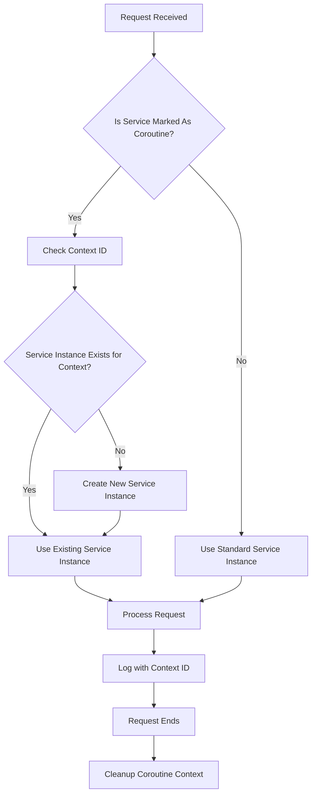

# Coroutine Service Workflow (Mermaid)

```mermaid
flowchart TD
    A[Request Received] --> B{Is Service Marked As Coroutine?}
    B -- Yes --> C[Check Context ID]
    C --> D{Service Instance Exists for Context?}
    D -- No --> E[Create New Service Instance]
    D -- Yes --> F[Use Existing Service Instance]
    E --> F
    F --> G[Process Request]
    G --> H[Log with Context ID]
    H --> I[Request Ends]
    I --> J[Cleanup Coroutine Context]
    B -- No --> K[Use Standard Service Instance]
    K --> G
```

该流程图描述了基于 AOP 的协程服务实例化与上下文管理的核心逻辑：

- 每个被标记为协程的服务，在每个请求上下文下都拥有独立实例。
- 日志记录自动带有 context_id。
- 请求结束后自动清理协程上下文资源。
